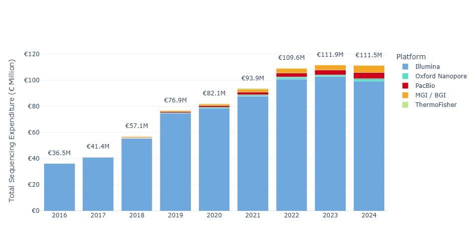

# Market Intelligence in Genomics: Data-Driven Insights for Research & Industry  

## Introduction  
The landscape of **genomics and its applications** is immensely vast, spanning **fundamental biological research, clinical diagnostics, and pharma/biotech innovation**. 

As such, **keeping track of technological advancements and emerging research directions** — and by extension, accurately mapping market trends with granularity — **has become increasingly complex**.  

While several platforms (e.g., **PubGrade, BiotechGate**) offer a wealth of structured information, they remain inherently **static**. They provide valuable data snapshots but lack **dynamic intelligence, real-time summarization, and predictive capabilities**.  

This project is an attempt to address such limitations across three core market segments.

---
## 1️. **Sequencing Trends & Expenditure in Academic Research** 

## Overview  
The starting point of this project involves the creation of a **graph database (Neo4j)** that aggregates and organizes scientific studies focused on the most prominent sequencing techniques/methods, including **RNA-seq, scRNA-seq, Spatial Transcriptomics, Whole Genome (WGS), Whole Exome (WES) sequencing, ATAC-seq, ChIP-seq, and TCR-seq**. The structure is designed for adaptability and can be easily transferred to **SQL-based relational databases**.  

### Core Database Structure  
  

### Visualization of Data Query Capabilities  
Flexibility in querying detailed information about studies and researchers in the database:  

  
  

  

### 📽️ Additional Media  
Check **[here](https://drive.google.com/file/d/14Qx4DzydU5uWo9ttAsMsMSX_Tsiq3b6x/view?usp=drive_link)** and **[here](https://drive.google.com/file/d/1OgZKWGWOV03JPGYA-DNNbyjW1ZKa6eBg/view?usp=drive_link)** for videos.  

---

## Graph Database - Initial Observations
This approach enables:  

- **Identification** of researchers working with specific sequencing methodologies, organized by scientific subject.  
- **Pinpointing** the institutions and countries where these researchers are located.  
- **Finding** studies based on **MeSH terms** or **Keywords**.  
- **Analyzing** trends across different journals and subjects over time.  

For instance, we can take a broad look at **sequencing platforms across key companies (NGS/Long-read/Third-generation):**  

*ThermoFisher overepresented due to an error, will eventually revisit this plot

We can also examine the evolution of sequencing platforms:  

  
<b>Sequencing Platforms Overview</b>

  

    
    
    
    
    
  

  

Or compare **single-read vs paired-end sequencing**, and **Whole Genome vs Whole Exome sequencing** in a specific country (e.g., Germany):  

  
<b>Single-read and Paired-end/WGS vs WES</b>

  

    
    
  

  

  
<b>Single-cell and Spatial Transcriptomics Analysis</b>

  

    
    
  

## Repository Metadata Database - Detailed Overview

**Note:**  
**All sequencing expenditure and cost-related figures presented here are estimations intended solely for comparison purposes and may not accurately reflect actual market expenditures.**

While the previously described database effectively maps researchers to institutions, fields of study, and sequencing methodologies, it does not fully capture detailed market trends. 
To address this limitation, I have collected sequencing metadata estimated to cover approximately 95% of all sequencing runs deposited across major repositories from 2016 to 2025. Cost estimations were derived using custom formulas tailored to each sequencing platform and, where possible, adjusted to reflect sample preparation methods and inflation or price changes over the analyzed period.

Each plot highlight important sequencing trends, platform expenditures, and potential areas of technological disruption, with a focus on research and industry insights:

### **Annual Sequencing Expenditure and Instrument Breakdown**

  
  

**Left:** Yearly breakdown shows growing expenditures in sequencing, peaking in recent years. **Illumina** remains the leading platform, but the steady rise in **PacBio** and **Nanopore** indicates increasing adoption of long-read technologies.
**Right:** Total estimated sequencing expenditure by instrument model, highlighting market dominance by platforms such as **Illumina NovaSeq 6000** and **MiSeq**.

---

## Integration with LLM Tools  
By utilizing an appropriate **embedding model**, each study can be represented in a **high-dimensional space**, allowing for **similarity assessments based on content**. This approach facilitates the identification of **potential collaborators and competitors** by leveraging the relationships and research focus of individual researchers.  

### Visualization  
Dimensionality reduction (**UMAP**) of a subset of **scRNA-seq studies in Europe** provides a visual representation of data clustering, such as COVID-19-related studies vs. other research:  

  

### Automated Messaging  
Through **prompt engineering**, it is possible to generate automated messages tailored to specific research topics. Below is a **zero-shot** example using an outdated LLM:  

> **Subject: Enhancing Your Research on Intestinal Treg Functions**  
>  
> Dear Dr. Researcher,  
>  
> I recently had the opportunity to delve into your compelling research on immune microniches shaping intestinal Treg function. Your innovative approach using in vivo live imaging alongside **photo-activation-guided single-cell RNA sequencing and spatial transcriptomics** offers a remarkable view into the interaction dynamics within the intestinal lamina propria.  
>  
> At Genomics, we specialize in **advanced sequencing capabilities and comprehensive bioinformatics solutions**. We would be thrilled to discuss how our services can support and expand the capabilities of your research.  
>  
> Best regards,  
> **John Polymerase**  
> *Genomics*  

---

## Data-Driven Insights for Research and Innovation  
By linking **structured data** and **similarity analysis** with **LLMs**, this system enables:  

- **Expenditure Insights and Forecasting** – Identify research investment trends across fields, regions, and institutions.  
- **Network & Collaboration Mapping** – Analyze researcher networks and institutional partnerships to support collaboration.  
- **Global Research & Innovation Trends** – Track emerging technologies, research priorities, and funding shifts.  
- **Resource Optimization & Strategic Planning** – Guide decision-making in funding, infrastructure, and talent allocation.  

---

## Future Enhancements  
Planned upgrades include:  

- **Natural Language Interface** – Enable users to query the database using natural language, making data retrieval more intuitive.  
- **Equipment and Reagent Cataloging** – A **fine-tuned NER model** to catalog sequencing machines and library prep kits, providing detailed insights into usage trends.  
- **Chatbot Development** – Develop an AI chatbot capable of advising on **sequencing services** and recommending techniques tailored to research needs.  
- **Expansion into Synthetic Biology (SynBio) and Sanger Sequencing**.  

---

## Ongoing Work  

2️. **Sequencing in Oncology Diagnostics** – Mapping sequencing technologies and expenditure in oncological diagnostics

- Hospitals/Clinics in Germany, Netherlands, France, Portugal, Spain 

3️. **AI Agents in Biotech/Pharma Sequencing Market Trends**
