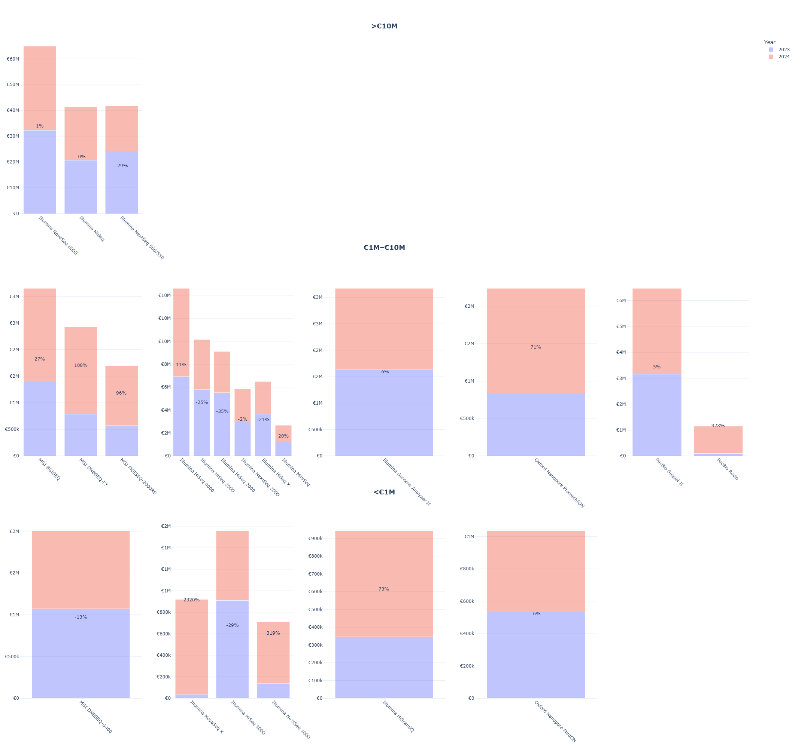
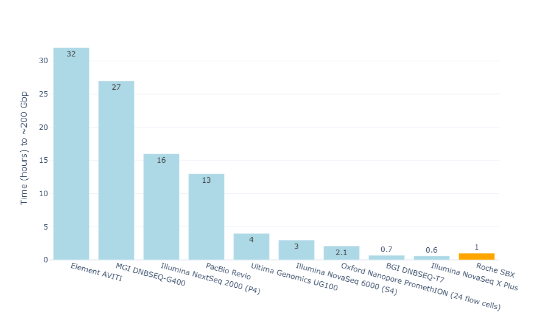

# Genomics Data Solutions for Research, Diagnostics & Industry

## Background
The landscape of genomics and its applications is immensely vast, spanning **basic research, clinical diagnostics, and pharma/biotech innovation**. As such, keeping track of technological advancements and emerging research directions — and by extension, accurately mapping market trends with granularity — **has become increasingly complex**.

While several platforms (e.g., **PubGrade, BiotechGate**) offer a wealth of structured information, they are fundamentally **static** in nature. Given the state of recent computational advancements, there are several tools that can provide a layer of **'dynamic intelligence'**, facilitating real-time database querying and summarization, automation of several processes, forecasting, and ultimately, **actionable insights (e.g., strategic planning, investment guidance, competitive intelligence).**

This project aims to briefly showcase my interest in addressing such limitations across three core market segments — **Academic Research**, **Cancer Diagnostics across Europe**, **Pharma/Biotech**, under three pillars:

1. Generation of high-quality databases
2. Direct, traditional extraction of insight via data querying, extraction, visualization
3. Development of LLM and agentic-based tools for easy querying and enhanced insights (under development)

<strong>Overview</strong>

- [Sequencing Trends & Expenditure in Academic Research](#sequencing-trends--expenditure-in-academic-research)
- [Roche Sequencing by Extension (SBX) Technology](#roche-sequencing-by-extension-sbx-technology)
- [Sequencing in Oncology – Mapping Genomic Sequencing Expenditures Across Hospitals and Clinics in Europe](#sequencing-in-oncology--mapping-genomic-sequencing-expenditures-across-hospitals-and-clinics-in-europe)
- [Mapping Researchers, Methodologies, Institutes in a Graph Database (Neo4j)](#mapping-researchers-methodologies-institutes-in-a-graph-database-neo4j)
- [Integration with LLM Tools](#integration-with-llm-tools)

---

## **Sequencing Trends & Expenditure in Academic Research** 

### Repository Metadata Database – Overview

**Note:** 
**More important than absolute numbers, emphasis should be put on understanding trends and rates of change. Some fundamental approximates were made, given the lack of information (e.g. flowcell utilization, academic discount packages, ...)**

Taking advantage of public datasets, I have collected **sequencing metadata** estimated to cover approximately 95% of all experiments present in major repositories from 2016 to 2025. This accounts for **~3 × 10¹⁴ reads**, **~30 million runs**, **~30 million experiments**.

**Cost estimations** were derived using custom formulas tailored to each sequencing platform and, where possible, **adjusted for sample preparation methods and price changes throughout the years**.

Below are some key plots highlighting important trends, expenditures, and potential areas of potential technological disruption:

### **Annual Sequencing Expenditure and Instrument Breakdown**

  
  

**Top:** Annual growth in sequencing expenditures, peaking in recent years. Illumina remains the leading platform, but there's a steady rise in MGI / BGI, PacBio, and Oxford Nanopore.

**Bottom:** Breakdown of total sequencing expenditure by instrument model (cummulative from 2016 until 2024), underscoring the market dominance of Illumina.

<strong>2023–2024 % expenditure changes per platform and model</strong>

### Experiment Cost and Read Length Across Platforms

  

This bubble plot summarizes real-world cost-efficiency across sequencing platforms. Each bubble represents an instrument model, positioned by its average cost per gigabase (y-axis, log scale) and total bases sequenced (x-axis). Bubble size reflects usage volume.
High-throughput platforms (e.g., NovaSeq, HiSeq X) appear in the bottom-right quadrant, showing strong cost-efficiency. Older or low-throughput systems (e.g., MiSeq, Genome Analyzer II) show higher per-Gb costs, while long-read platforms (e.g., PacBio Sequel II) occupy distinct mid-throughput, higher-cost territory.

  

This scatterplot shows the relationship between average read length and experiment-level sequencing cost, across platforms.
Short-read technologies (Illumina, MGI, ThermoFisher) dominate the low-read-length region (~100–300 bp), covering a broad range of costs. Long-read technologies (PacBio, Oxford Nanopore) cluster at longer read lengths and higher cost variability, reflecting their niche in complex or structure-resolving sequencing.
  

### At the Institutional Level - Max Planck Society as an Example

All the previous plots provide top-down perspectives, but we can then start making more directed questions, for instance at the institute level. Take the example of the Max Planck Society, composed of 84 institutes, of which some are present in my database:

  
List of Max Planck Institutes

  - Max Planck Institute for Evolutionary Anthropology  
  - Max Planck Institute for Chemical Ecology  
  - Max Planck Institute of Immunobiology and Epigenetics  
  - Max Planck Institute for Plant Breeding Research  
  - Max Planck Institute for Marine Microbiology  
  - Max Planck Institute for Evolutionary Biology  
  - Max Planck Institute for Molecular Genetics  
  - Max Planck Institute for Biology Tuebingen  
  - Max Planck Institute for Biology of Ageing  
  - Max Planck Institute for Biogeochemistry  
  - Max Planck Institute for Ornithology  
  - Max Planck Institute for Molecular Biomedicine  
  - Max Planck Institute for Biophysical Chemistry  
  - Max Planck Unit for the Science of Pathogens  
  - Max Planck Institute for Terrestrial Microbiology  
  - Max Planck Institute for Chemistry  
  - Max Planck Institute for Heart and Lung Research  
  - Max Planck Institute for the Science of Human History  
  - Max Planck Institute for Infection Biology  
  - Max Planck Institute of Molecular Plant Physiology  
  - Max Planck Institute of Molecular Cell Biology and Genetics  

What sequencing patterns can be observed across institutes? Which platforms are they predominantly using, and what library preparation strategies are being employed? Given the distinct research focuses of each institute, some differences in these choices are to be expected.

  

Different sequencing platforms compared in terms of total output and read characteristics. Each bubble corresponds to a platform-institute combination, with its size indicating the number of experiments conducted. A few institutes, among these **MPI Tübingen**, clearly dominate both in terms of data volume and experiment count.

  
<b>Library Strategies</b>

  

    
  

  
<b>Platform Usage per Institute</b>

  

    
  

  
<b>Main Institutes per Platform</b>

  

    
  

---

## Roche Sequencing by Extension (SBX) Technology

**Roche** has recently launched a new sequencing platform with the potential not only to position itself as a competitor in the genomics space, but to define a new category on its own. It is a nanopore-based method that leverages a novel sequencing chemistry (Xpandomer-based SBX) and a high-throughput CMOS sensor module, **enabling single-molecule electrical detection with short-read-like accuracy**.

To explore where SBX may position itself relative to current sequencing platforms, I generated a set of exploratory plots based on Roche's publicly stated performance claims:

### SBX Technology Projected Performance vs. Current Platforms

  

Hypothetical overlay of **Roche’s Sequencing by Expansion (SBX)** technology, showcasing its potential range for throughput and cost-efficiency.
At 200 Gbp/hour and an estimated cost of €400–€1200 per run, it is possible to observe that very few sequencing runs fall in this thoughput-cost region. Note: SBX cost estimates reflect reagent-run expenses only - I will revisit this plot accounting for library prep. 

### Time to Generate ~200 Gbps: SBX vs Existing Instruments

  

### Roche SBX Revenue Scenarios by Market Share and Reagent Overhead

I have also looked at potential revenue that Roche could generate from its SBX platform considering if it captures between 5% and 25% of the 2024 sequencing market currently served by major competitors. Each subplot represents a competing platform class:

- **Illumina NovaSeq (6000, X, X Plus)**
- **BGI/MGI (BGISEQ, DNBSEQ, MGISEQ)**
- **PacBio (RS, Sequel, Revio)**
- **Oxford Nanopore (MinION, GridION, PromethION)**

Three assumptions are considered:
- **Base (20%)**: Roche charges ~20% more for specialized SBX reagents (Xpandomers might be costly)
- **No Overhead (0%)**: Roche matches current reagent pricing  
- **High Overhead (35%)**: Roche prices SBX reagents at 35% above baseline

---

## Sequencing in Oncology – Mapping Genomic Sequencing Expenditures Across Hospitals and Clinics in Europe

Cancer incidence is rising globally, with the number of new cases projected to nearly double by 2050 compared to 2025 ([WHO International Agency for Research on Cancer](https://www.iarc.who.int/)). In this context, I have explored the financial landscape of genomic sequencing in oncology, with a particular emphasis on Europe. 

While sequencing may not always be pivotal for initial diagnosis, it plays a critical role in guiding therapeutic decision-making and treatment stratification. I have a strong personal interest in colorectal and lung cancer subtypes, due to their incidence on the maternal side of my family, which [originates from Goa](https://en.wikipedia.org/wiki/Portuguese_India).

  

  
  

  

In order to have a **high-level and initial estimation of genomic sequencing expenditure**, based on current (2022) and future (2050) cancer incidence, I have decided to explore a very basic scenario. Europe and North America are aggregated here as regions where **some adoption of sequencing is already underway**.

This approach assumes one sample per case, and explores a range of **uptake levels**, defined here as the proportion of newly diagnosed cancer cases that would undergo genomic sequencing. Different cost scenarios are tested, ranging from €200 to €1000 per sample. The analysis reflects the use of **targeted panel sequencing**, which is currently the most common approach in oncology for identifying actionable mutations.

  

  

In particular, within the European Union, [**cancer continues to pose a significant public health burden**](https://www.oecd.org/en/publications/eu-country-cancer-profiles-synthesis-report-2025_20ef03e1-en.html): **every minute, approximately five people are diagnosed with the disease**, while **more than two lose their lives to it**. In 2022, over 2.7 million new cancer cases were estimated across member countries; by 2021, it had become the **second leading cause of death** after cardiovascular disease with **1.15 million deaths** recorded that year.

My aim is to better understand how much is being spent on genomic sequencing at both the **national and regional levels** across Europe, starting with Germany as a case study. For this, I have gathered [cancer incidence data from 2020](https://www.dkr.de/), covering major cancer types including lung, colorectal, ovarian, breast, prostate, pancreatic, melanoma, leukemia, uterine, and non-Hodgkin lymphoma.

To get a sense of where these cases are most likely diagnosed or treated, I [compiled a list of hospitals in each region](https://www.german-hospital-directory.com).

Below is a snapshot showing the **top five hospitals by number of cancer-related cases** (including both diagnoses and ongoing treatments) in three federal states: Berlin, Bavaria, and North Rhine-Westphalia (NRW):

  

  

  

It is noticeable that in Berlin, which is a city-state, urban and densely populated, the majority of cases are concentrated in a few large hospitals, most prominently Charité (Europe’s largest university hospital). Meanwhile, in Bavaria and North Rhine-Westphalia, cancer-related care is spread out over numerous hospitals, reflecting the fact that these regions contain many spread out prominent cities.

  
Full distribution of hospital data across all of Germany’s federal states

   
  

---

## Mapping Researchers, Methodologies, Institutes in a Graph Database (Neo4j)

I have also developed a **graph database** that aggregates and organizes scientific studies focusing on prominent sequencing techniques (e.g., **RNA-seq, scRNA-seq, WGS, WES, ATAC-seq**). This flexible design can be transferred to **SQL-like** framework.

### Core Database Structure

### Visualization of Data Query Capabilities
Flexibility in querying detailed information about studies and researchers:

  
  

### 📽️ Additional Media
Check **[here](https://drive.google.com/file/d/14Qx4DzydU5uWo9ttAsMsMSX_Tsiq3b6x/view?usp=drive_link)** and **[here](https://drive.google.com/file/d/1OgZKWGWOV03JPGYA-DNNbyjW1ZKa6eBg/view?usp=drive_link)** for videos.

---

### Graph Database – Further Observations
- **Identification** of researchers working with specific sequencing methods, grouped by subject.
- **Pinpointing** institutions/countries where these researchers are located.
- **Finding** studies based on **MeSH terms** or keywords.
- **Analyzing** trends across journals, subjects, and time frames.

  
<b>Sequencing Platforms Overview</b>

  

    
    
    
    
    
  

  
<b>Single-read vs Paired-end & WGS vs WES (Example: Germany)</b>

  

    
    
  

  
<b>Single-cell and Spatial Transcriptomics Analysis</b>

  

    
    
  

---

## Integration with LLM Tools
By leveraging appropriate **embedding models**, each study can be projected into a **high-dimensional space** to enable content-based similarity assessments. This capability helps identify **collaborators, competitors,** and research overlaps.

### Visualization
Dimensionality reduction (UMAP) on a **subset of scRNA-seq studies in Europe** reveals clustering (e.g., COVID-19–focused research vs other topics):

### Automated Messaging
Using **prompt engineering**, we can generate automated, topic-specific messages. It is possible to include a substantial amount of scientific context, but here is a simpler, **zero-shot** example:

> **Subject: Enhancing Your Research on Intestinal Treg Functions**  
>  
> Dear Dr. Researcher,  
>  
>  
> I recently had the opportunity to delve into your compelling research on immune microniches shaping intestinal Treg function. Your innovative approach using in vivo live imaging alongside **photo-activation-guided single-cell RNA sequencing and spatial transcriptomics** offers a remarkable view into the interaction dynamics within the intestinal lamina propria.  
>  
> At Genomics, we specialize in **advanced sequencing capabilities and comprehensive bioinformatics solutions**. We would be thrilled to discuss how our services can support and expand the capabilities of your research.  
>  
> Best regards,  
> **John Polymerase**  
> *Genomics*  
>  

---

## Data-Driven Insights for Research and Innovation
By linking **structured data** and **similarity analysis** with **LLMs**, this system enables:
- **Expenditure Insights and Forecasting** – Identify trends across fields, regions, and institutions.
- **Network & Collaboration Mapping** – Analyze researcher networks to support collaboration.
- **Global Research & Innovation Trends** – Track emerging technologies and funding shifts.
- **Resource Optimization & Strategic Planning** – Guide decisions on funding, infrastructure, and talent.

---

## Future Enhancements
- **Natural Language Interface** – Query the database using everyday language.
- **Equipment and Reagent Cataloging** – A **fine-tuned NER** to list instruments/kits for deeper usage insights.
- **Chatbot Development** – AI to advise on **sequencing services** and propose best-fit techniques.
- **Expansion** – SynBio and Sanger Sequencing integration.

---

## Ongoing Work

3. **AI Agents in Biotech/Pharma Sequencing Market Trends**

