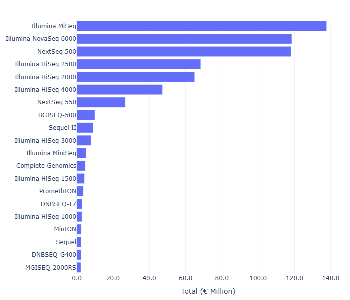
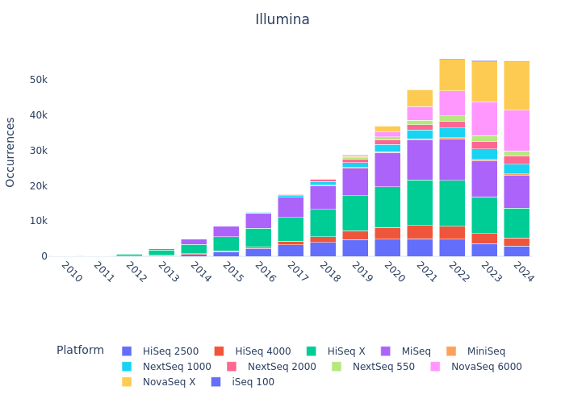

# Genomics Market Intelligence for Research, Diagnostics & Industry

## Background
The landscape of genomics and its applications is immensely vast, spanning **basic research, clinical diagnostics, and pharma/biotech innovation**. As such, keeping track of technological advancements and emerging research directions — and by extension, accurately mapping market trends with granularity — **has become increasingly complex**.

While several platforms (e.g., **PubGrade, BiotechGate**) offer a wealth of structured information, they are fundamentally **static** in nature. In addition, most industry reports, despite bold predictions, often lack transparency in methodology and grounding on data.

Given the state of recent computational advancements, there are several tools that can provide a layer of **'dynamic intelligence'**, facilitating real-time database querying and summarization, automation of several processes, forecasting, and ultimately, **actionable insights (e.g., strategic planning, investment guidance, competitive intelligence).**

This project aims to address such limitations across three core market segments - **Academic Research**, **Cancer Diagnostics across Europe**, **Pharma/Biotech** - through generation of high-quality databases, actionable insights, and tools that would improve these two.
I won't get into immense detail - for that I will eventually choose another platform to do so, but would be happy to discuss the rationale and some of the ideas.

---

## 1️. **Sequencing Trends & Expenditure in Academic Research** 

### Repository Metadata Database – Overview

**Note:** 
**all sequencing expenditure and cost-related figures presented here are based on gross assumptions, and most likely do not accurately reflect actual market expenditures. More important than absolute numbers, emphasis should be put on understanding trends and rates of change.**

  

Taking advantage of public datasets, I have collected **sequencing metadata** estimated to cover approximately 95% of all experiments present in major repositories from 2016 to 2025. This accounts for **~3 × 10¹⁴ reads**, **~30 million runs**, **~30 million experiments**.

**Cost estimations** were derived using custom formulas tailored to each sequencing platform and, where possible, **adjusted for sample preparation methods and price changes throughout the years**.

Below are **key plots** highlighting important trends, expenditures, and areas of potential technological disruption:

### **Annual Sequencing Expenditure and Instrument Breakdown**

  
  

**Top:** Annual growth in sequencing expenditures, peaking in recent years. Illumina remains the leading platform, but the steady rise in PacBio and Nanopore indicates increasing adoption of long-read technologies.

**Bottom:** Break down of total sequencing expenditure by instrument model (cummulative from 2016 until 2024), underscoring the market dominance of platforms like Illumina NovaSeq 6000 and MiSeq.

<strong>2023–2024 % expenditure changes per platform and model</strong>

According to a report by DeciBio, the **total NGS market is valued (2024) at 6.4b USD**. As my numbers refer to academic research only (**est. €1.5-2b**), and believing the non-academic market to be **at least one order of magnitude larger in non-academic sequencing**, it could very well be that I am overestimating the real market value. I will look for other reports in other to benchmark my numbers, feel free to send any you find meaningful.
  
### Run Costs and Throughput by Platform

  

  

Relationship between **sequencing run cost** and **throughput (base count)**: short-read platforms (e.g., Illumina, DNBSEQ) generally offer strong cost-efficiency at higher throughputs, whereas long-read technologies (PacBio, Nanopore) operate in a different niche—offering longer reads but often at higher costs per Gbps.
  
### At the Institutional Level - Max Planck Society as an Example

All the previous plots provide top-down perspectives, but we can then start making more directed questions, for instance at the institute level. Take the example of the Max Planck Society, composed of 84 institutes, of which some are present in my database:

  
List of Max Planck Institutes

  - Max Planck Institute for Evolutionary Anthropology  
  - Max Planck Institute for Chemical Ecology  
  - Max Planck Institute of Immunobiology and Epigenetics  
  - Max Planck Institute for Plant Breeding Research  
  - Max Planck Institute for Marine Microbiology  
  - Max Planck Institute for Evolutionary Biology  
  - Max Planck Institute for Molecular Genetics  
  - Max Planck Institute for Biology Tuebingen  
  - Max Planck Institute for Biology of Ageing  
  - Max Planck Institute for Biogeochemistry  
  - Max Planck Institute for Ornithology  
  - Max Planck Institute for Molecular Biomedicine  
  - Max Planck Institute for Biophysical Chemistry  
  - Max Planck Unit for the Science of Pathogens  
  - Max Planck Institute for Terrestrial Microbiology  
  - Max Planck Institute for Chemistry  
  - Max Planck Institute for Heart and Lung Research  
  - Max Planck Institute for the Science of Human History  
  - Max Planck Institute for Infection Biology  
  - Max Planck Institute of Molecular Plant Physiology  
  - Max Planck Institute of Molecular Cell Biology and Genetics  

What sequencing patterns can be observed across institutes? Which platforms are they predominantly using, and what library preparation strategies are being employed? Given the distinct research focuses of each institute, some differences in these choices are to be expected.

  

Different sequencing platforms compared in terms of total output and read characteristics. Each bubble corresponds to a platform-institute combination, with its size indicating the number of experiments conducted. A few institutes, among these **MPI Tübingen**, clearly dominate both in terms of data volume and experiment count.

  
<b>Library Strategies</b>

  

    
  

  
<b>Platform Usage per Institute</b>

  

    
  

  
<b>Main Institutes per Platform</b>

  

    
  

---

## Roche Sequencing by Extension (SBX) Technology

**Roche** has recently launched a new sequencing platform with the potential not only to position itself as a competitior in the genomics space, but to define a new category on its own. It is a nanopore-based method that leverages a novel sequencing chemistry (Xpandomer-based SBX) and a high-throughput CMOS sensor module, **enabling single-molecule electrical detection with short-read-like accuracy**.

To explore where SBX may position itself relative to current sequencing platforms, I generated a set of exploratory plots based on Roche's publicly stated performance claims:

### SBX Technology Projected Performance vs. Current Platforms

  

Hypothetical overlay of **Roche’s Sequencing by Expansion (SBX)** technology, showcasing its potential range for throughput and cost-efficiency.
At 200 Gbp/hour and an estimated cost of €400–€1200 per run, it is possible to observe that very few sequencing runs fall in this thoughput-cost region.

### Time to Generate ~200 Gbps: SBX vs Existing Instruments

  

---

## Mapping Researchers, Methodologies, Institutes in Graph Database (Neo4j)

I have also developed a **graph database** that aggregates and organizes scientific studies focusing on prominent sequencing techniques (e.g., **RNA-seq, scRNA-seq, WGS, WES, ATAC-seq**). This flexible design can be transferred to **SQL-like** framework.

### Core Database Structure

### Visualization of Data Query Capabilities
Flexibility in querying detailed information about studies and researchers:

  
  

### 📽️ Additional Media
Check **[here](https://drive.google.com/file/d/14Qx4DzydU5uWo9ttAsMsMSX_Tsiq3b6x/view?usp=drive_link)** and **[here](https://drive.google.com/file/d/1OgZKWGWOV03JPGYA-DNNbyjW1ZKa6eBg/view?usp=drive_link)** for videos.

---

### Graph Database – Further Observations
- **Identification** of researchers working with specific sequencing methods, grouped by subject.
- **Pinpointing** institutions/countries where these researchers are located.
- **Finding** studies based on **MeSH terms** or keywords.
- **Analyzing** trends across journals, subjects, and time frames.

  
<b>Sequencing Platforms Overview</b>

  

    
    
    
    
    
  

  
<b>Single-read vs Paired-end & WGS vs WES (Example: Germany)</b>

  

    
    
  

  
<b>Single-cell and Spatial Transcriptomics Analysis</b>

  

    
    
  

---

## Integration with LLM Tools
By leveraging appropriate **embedding models**, each study can be projected into a **high-dimensional space** to enable content-based similarity assessments. This capability helps identify **collaborators, competitors,** and research overlaps.

### Visualization
Dimensionality reduction (UMAP) on a **subset of scRNA-seq studies in Europe** reveals clustering (e.g., COVID-19–focused research vs other topics):

### Automated Messaging
Using **prompt engineering**, we can generate automated, topic-specific messages. It is possible to include a substantial amount of scientific context, but here is a simpler, **zero-shot** example:

> **Subject: Enhancing Your Research on Intestinal Treg Functions**  
>  
> Dear Dr. Researcher,  
>  
>  
> I recently had the opportunity to delve into your compelling research on immune microniches shaping intestinal Treg function. Your innovative approach using in vivo live imaging alongside **photo-activation-guided single-cell RNA sequencing and spatial transcriptomics** offers a remarkable view into the interaction dynamics within the intestinal lamina propria.  
>  
> At Genomics, we specialize in **advanced sequencing capabilities and comprehensive bioinformatics solutions**. We would be thrilled to discuss how our services can support and expand the capabilities of your research.  
>  
> Best regards,  
> **John Polymerase**  
> *Genomics*  
>  

---

## Data-Driven Insights for Research and Innovation
By linking **structured data** and **similarity analysis** with **LLMs**, this system enables:
- **Expenditure Insights and Forecasting** – Identify trends across fields, regions, and institutions.
- **Network & Collaboration Mapping** – Analyze researcher networks to support collaboration.
- **Global Research & Innovation Trends** – Track emerging technologies and funding shifts.
- **Resource Optimization & Strategic Planning** – Guide decisions on funding, infrastructure, and talent.

---

## Future Enhancements
- **Natural Language Interface** – Query the database using everyday language.
- **Equipment and Reagent Cataloging** – A **fine-tuned NER** to list instruments/kits for deeper usage insights.
- **Chatbot Development** – AI to advise on **sequencing services** and propose best-fit techniques.
- **Expansion** – SynBio and Sanger Sequencing integration.

---

## Ongoing Work
2. **Sequencing in Oncology Diagnostics** – Mapping technologies and expenditures in oncological diagnostics across hospitals/clinics in Germany, Netherlands, France, Portugal, Spain.

3. **AI Agents in Biotech/Pharma Sequencing Market Trends**

